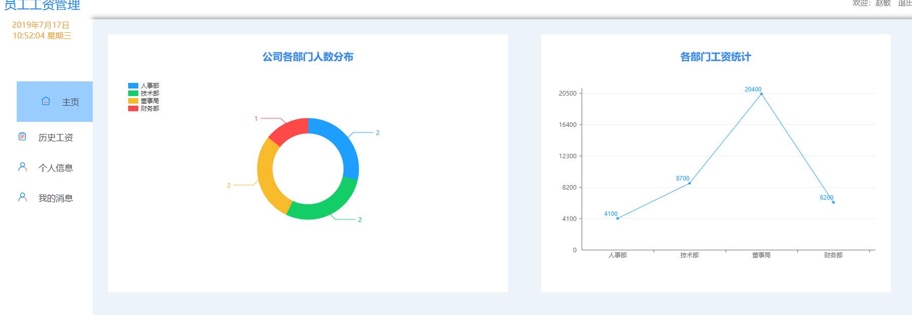
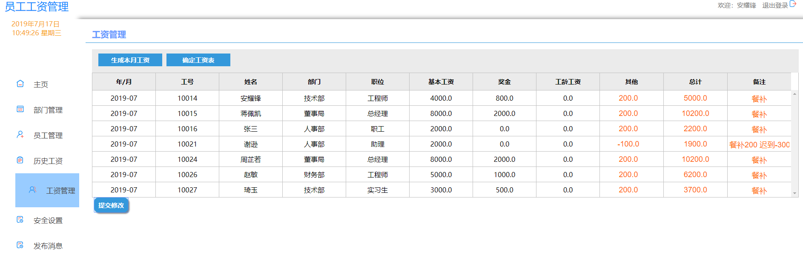
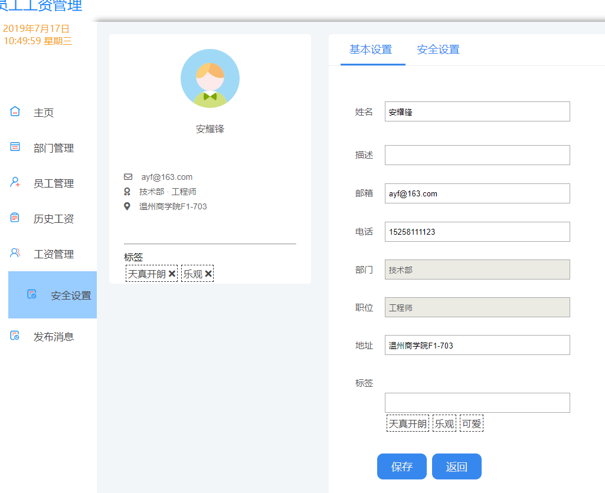
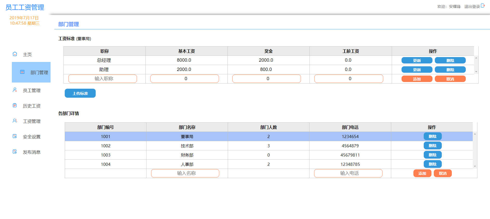
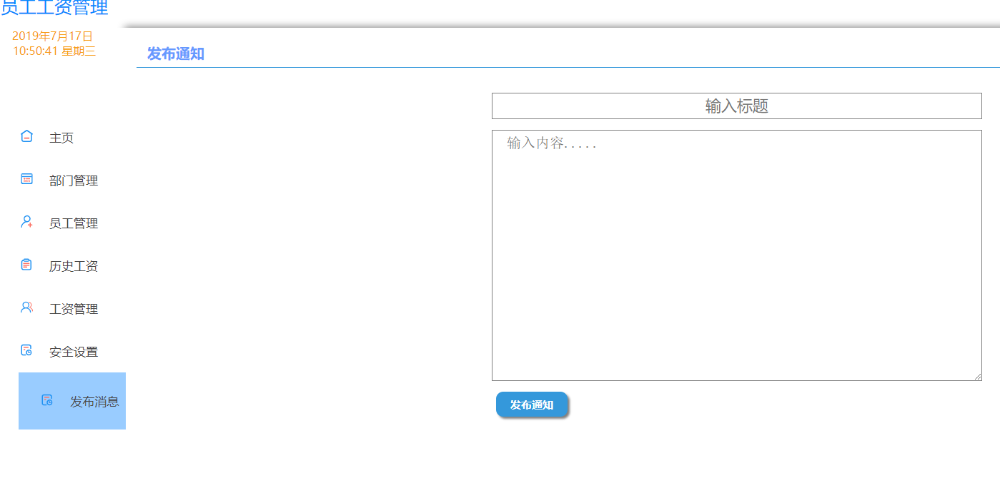

# 员工工资管理系统
（前端使用vue（较基础）后台使用JAVA、MYSQL；doc文件夹下有测试用的excel表和数据库备份）
## 主要功能
### 一、管理员模块
    1.对部门、员工信息的管理,员工信息可以由excel表导入;
    2.各部门职称管理，员工基本工资根据职称来，各部门可以不同；
    3.可以查看历史工资单，生成当月工资单，并修改工资单；
    4.可以发布通知给员工
### 二、员工模块
    1.可以查看自己的历史工资详情；
    2.修改个人信息、密码；
    3.查看消息，设置是否接收消息；
## 效果图

